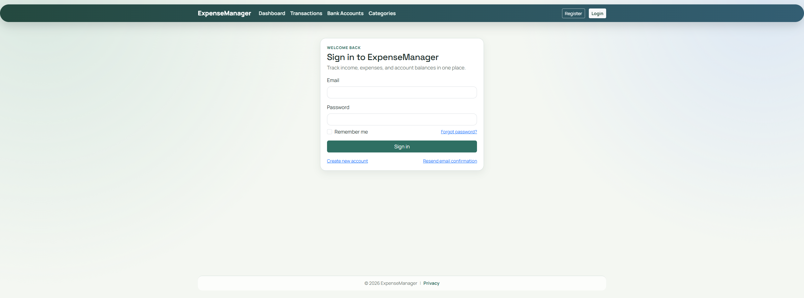
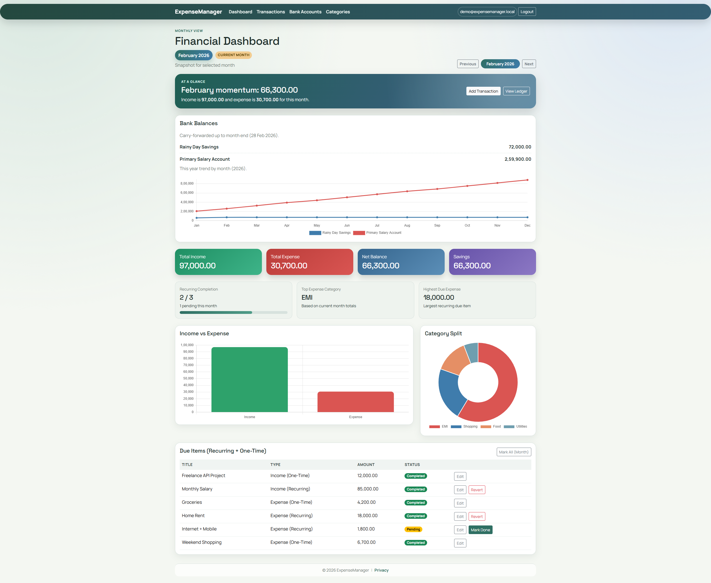
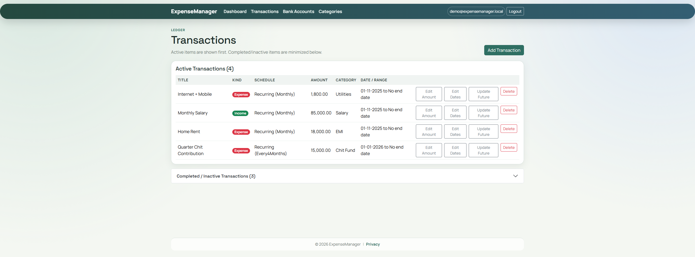
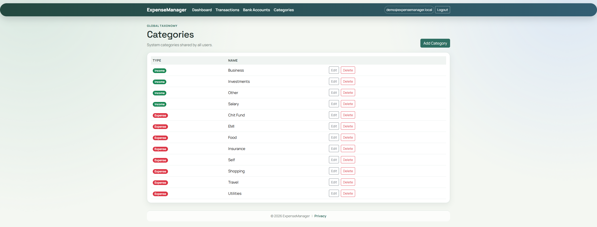

# Personal Expense & Income Management System


A secure web-based personal finance manager built with **ASP.NET Core**, **Entity Framework Core**, and **SQLite**. Track income and expenses (one-time and recurring), manage bank accounts, and view a monthly financial dashboard.

---

## Table of Contents

- [Tech Stack](#tech-stack)
- [Features](#features)
- [Images](#images)
- [Getting Started](#getting-started)
- [Project Structure](#project-structure)

---

## Tech Stack

| Layer        | Technology                          |
| ------------ | ------------------------------------ |
| Framework    | ASP.NET Core (.NET 10)               |
| Database     | SQLite (file-based, no server)       |
| ORM          | Entity Framework Core                |
| Auth         | ASP.NET Core Identity (cookie-based) |
| UI           | MVC with Razor views                 |

---

## Features

### 1. User Authentication

- **Register** – Create an account with email and password.
- **Login / Logout** – Secure sign-in with cookie-based sessions.
- **Forgot password / Reset password** – Handled via ASP.NET Core Identity UI.
- **Data isolation** – Every record is tied to the logged-in user; users only see their own data.
- **Roles** – User role in place; structure is ready for future Admin role.

---

### 2. Income Management

Add and manage income in two ways:

| Type       | Use case                                      |
| ---------- | --------------------------------------------- |
| **One-time** | Freelance payment, bonus, gift, one-off income |
| **Recurring** | Salary, rental income, monthly business revenue |

**Income fields:**

- **Title** – Short description (e.g. “Monthly salary”).
- **Amount** – Decimal value.
- **Category** – From income categories (Salary, Business, Investments, Other, or custom).
- **Type** – One-time or Recurring.
- **Frequency** (recurring only) – Weekly, Monthly, Quarterly, Every 4 months, Half-yearly, Yearly.
- **Start date / End date** (recurring) – When the recurring income begins and optionally ends.
- **Received to account** (optional) – Bank account that receives the income.
- **Is active** – Recurring items can be paused without deleting.

**Behaviour:**

- **One-time:** Stored once with a specific date; counted in that month on the dashboard.
- **Recurring:** Projected on-the-fly for each month. Only months where the item is *due* are included (e.g. “Every 4 months” from Jan → Jan, May, Sep).
- **Past start dates:** If start date is in the past, all due months from start up to the selected month are included in the dashboard.
- **End date:** Recurrence stops after the end date; no projection beyond it.
- **Mark as completed:** For a given month, you can mark a recurring income as “received” so the dashboard shows it as completed vs pending.

---

### 3. Expense Management

Add and manage expenses in two ways:

| Type       | Use case                                      |
| ---------- | --------------------------------------------- |
| **One-time** | Shopping, medical bill, one-off spending     |
| **Recurring** | EMI, chit fund, subscriptions, rent          |

**Expense fields:**

- **Title** – Short description (e.g. “Home loan EMI”).
- **Amount** – Decimal value.
- **Category** – From expense categories (Food, Travel, EMI, Chit Fund, Utilities, Insurance, Shopping, or custom).
- **Type** – One-time or Recurring.
- **Frequency** (recurring only) – Weekly, Monthly, Quarterly, Every 4 months, Half-yearly, Yearly.
- **Start date / End date** (recurring) – When the recurring expense begins and optionally ends.
- **Paid from account** (optional) – Bank account from which the expense is paid.
- **Is active** – Recurring expenses can be paused.

**Behaviour:**

- **One-time:** Stored once with a specific date; counted in that month.
- **Recurring:** Projected on-the-fly. Non-monthly frequencies (e.g. every 4 or 6 months) only count in due months (e.g. chit in Jan, May, Sep).
- **Late entry:** If you add a recurring expense after its start date (e.g. start Jan 2024, you add it in Aug 2025), the dashboard still shows all due months from Jan 2024 so totals are correct.
- **Mark as completed:** For a given month, you can mark a recurring expense as “paid” so the dashboard shows completed vs pending and you can record a different amount if needed (e.g. partial payment).

**Transaction actions:**

- **Create** – Add one-time or recurring income/expense with full form.
- **Index** – List active and completed transactions.
- **Update future** – For recurring items: change amount, start/end date, or frequency from a chosen date; only future occurrences are affected.
- **Edit amount** – Change the amount for a recurring transaction (used for “mark completed” with a different amount).
- **Edit dates** – Change start and/or end date for a recurring transaction.
- **Mark completed** – For a specific year/month, mark a recurring item as completed (optionally with a different amount).
- **Mark all completed** – Mark all due recurring items for a month as completed in one go.
- **Revert completed** – Remove the “completed” mark for a recurring item in a given month.
- **Delete** – Soft delete a transaction (hidden, not physically removed).

---

### 4. Category Management

- **Predefined categories** – Seeded on first run:
  - **Income:** Salary, Business, Investments, Other.
  - **Expense:** Food, Travel, EMI, Chit Fund, Utilities, Insurance, Shopping.
- **Custom categories** – Add your own income or expense categories.
- **CRUD:** List all, Create, Edit, Delete. Duplicate names per type are prevented.
- Every income and expense must have a category; use “Uncategorized” or a custom category if needed.

---

### 5. Bank Account Management

- **Multiple accounts** – Add several bank accounts (e.g. Salary, Savings, Cash, Wallet).
- **Account types** – Savings, Current, Cash, Wallet, Salary.
- **Initial balance** – Set when creating the account.
- **Current balance** – By default **calculated** as:  
  `Initial balance + sum(income to account) − sum(expenses from account)`  
  up to the current month (or selected month when viewed from the dashboard).
- **Manual override** – Option to use a manual balance instead of the calculated one (e.g. after reconciling with bank statement).
- **CRUD:** List (with current balance), Create, Edit, Delete (soft delete).
- **User-scoped** – Only your accounts are visible and editable.

---

### 6. Monthly Dashboard

- **Month selector** – Choose year and month to view that month’s summary.
- **Summary cards:**
  - **Total income** – One-time income in that month + recurring income due in that month (with “mark completed” amount where applicable).
  - **Total expense** – One-time expense in that month + recurring expense due in that month (with “mark completed” amount where applicable).
  - **Net balance** – Total income − total expense.
  - **Savings** – Same as net balance (shown for clarity).
- **Bank balances** – Current balance per bank account for the selected month (or manual override if set). Helps plan for non-monthly payments (e.g. chit due every 4 or 6 months).
- **Category breakdown** – Category-wise totals (income and expense) for the month, including both one-time and recurring items.
- **Recurring due items** – List of recurring income/expense due in that month with:
  - Title, amount, type (income/expense)
  - Completed vs pending (based on “mark as completed”).
- **Extra stats** – Completed vs pending recurring count, top expense category, highest due expense amount.

**Dashboard calculation rules:**

- **Income** = One-time income in that month + Recurring income due in that month (only in due months for non-monthly frequencies).
- **Expense** = One-time expense in that month + Recurring expense due in that month (same rule).
- **Recurring “due in month”** – Weekly: at least one occurrence in the month; Monthly: every month; Quarterly: every 3 months; Every 4 months: Jan, May, Sep, etc.; Half-yearly: every 6 months; Yearly: once per year.
- **Mark as completed** – If a recurring item is marked completed for that month, the completed amount (which may differ from the template amount) is used in totals and in bank balance logic where applicable.

---

### 7. Recurrence Frequencies (Detail)

| Frequency       | Due months (example from Jan 2024)     |
| --------------- | --------------------------------------- |
| Weekly          | Every week (multiple occurrences per month) |
| Monthly         | Every month                             |
| Quarterly       | Jan, Apr, Jul, Oct                      |
| Every 4 months  | Jan, May, Sep                           |
| Half-yearly     | Jan, Jul                                |
| Yearly          | January only                            |

Start/end date and “is active” determine which of these due dates are included.

---

### 8. Data & Security

- **Soft delete** – Transactions and bank accounts use soft delete (IsDeleted); data can be retained for audit.
- **Audit fields** – CreatedAt, UpdatedAt on relevant entities.
- **User ownership** – All queries filter by current user ID; no cross-user data access.
- **Validation** – Input validation and parameterized queries (EF Core) to avoid invalid data and SQL injection.
- **HTTPS** – Recommended in production.

---

### 9. Edge Cases Handled

- Recurring item with start date in the past → all due months from start are included in the dashboard.
- Editing recurring amount or dates → “Update future” and “Edit amount” / “Edit dates” support mid-cycle changes.
- Pausing or deleting recurring entry → IsActive and soft delete prevent it from appearing in future projections.
- Recurring completion with different amount → “Mark as completed” can store a custom amount for that month.
- Bank balance → Uses initial balance + transactions (and optional manual override) for the selected or current month.

---

## Images

Screenshots from the application (from `ExpenseManager/Images/`):

| Screen | Screenshot |
|--------|------------|
| **Login** |  |
| **Dashboard** |  |
| **Transactions** |  |
| **Bank Accounts** |  |
| **Categories** |  |

---

## Getting Started

### Prerequisites

- **.NET 10 SDK** (or the SDK matching the project’s target framework).
- **SQLite** – No separate database server; the app uses a file (e.g. `app.db`).
- **IDE** – Visual Studio 2022 or VS Code with C# extension.

### Run the application

1. **Clone the repository** and open the solution (e.g. open the folder in VS/VS Code).
2. **Database** – Ensure `appsettings.json` has a SQLite connection string (e.g. `Data Source=app.db`). The project is configured to create/use the file in the application directory.
3. **Migrations** – From the project that contains the DbContext (ExpenseManager):
   ```bash
   dotnet ef database update
   ```
4. **Run the web app:**
   ```bash
   dotnet run --project ExpenseManager
   ```
5. Open the URL shown (e.g. `https://localhost:5001` or `http://localhost:5000`), then **Register** and **Login**.

### First-time setup

- On first run, seed data creates default **Income** and **Expense** categories.
- Add at least one **Bank account** (optional but useful for linking transactions).
- Add **Income** and **Expense** (one-time or recurring), then open the **Dashboard** and pick a month to see the summary.

---

## Project Structure

```
ExpenseManager/
├── Controllers/
│   ├── HomeController.cs
│   ├── DashboardController.cs    # Monthly dashboard
│   ├── TransactionsController.cs # Income & expense CRUD + recurring actions
│   ├── CategoriesController.cs  # Category CRUD
│   └── BankAccountsController.cs
├── Models/
│   ├── TransactionEntry.cs      # Income/expense entity
│   ├── Category.cs
│   ├── BankAccount.cs
│   ├── Enums.cs                  # CategoryType, ScheduleType, Frequency, etc.
│   ├── AuditableEntity.cs
│   └── ViewModels/
├── Services/
│   ├── IDashboardService.cs
│   └── DashboardService.cs       # Month build, balance, recurrence logic
├── Data/
│   ├── ApplicationDbContext.cs
│   ├── SeedData.cs               # Default categories
│   └── Migrations/
├── Views/                        # Razor views per feature
├── Areas/Identity/               # ASP.NET Core Identity (Register, Login, etc.)
└── Program.cs
```

---

## Sample User Flow

1. **Register** and log in.
2. **Add a bank account** (e.g. “Salary account”, initial balance ₹50,000).
3. **Add salary** – Recurring income ₹60,000/month from Jan 2024, received to Salary account.
4. **Add EMI** – Recurring expense ₹10,000/month from Jan 2024 to Dec 2026, paid from Salary account.
5. **Open Dashboard** and select **Feb 2024**:
   - Income: ₹60,000  
   - Expense: ₹10,000  
   - **Net: ₹50,000**
6. Use **Mark as completed** for salary and EMI when paid/received, and optionally **edit amount** for that month if needed.

---

## Possible Future Enhancements (Phase 2+)

- Budget planning and savings goals.
- PDF and Excel export.
- Notifications for due EMI and recurring reminders.
- Richer charts and analytics.
- Multi-currency support.

---

## License

See repository or project license file if present.
