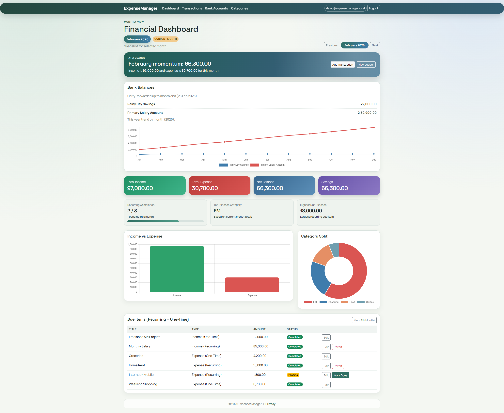
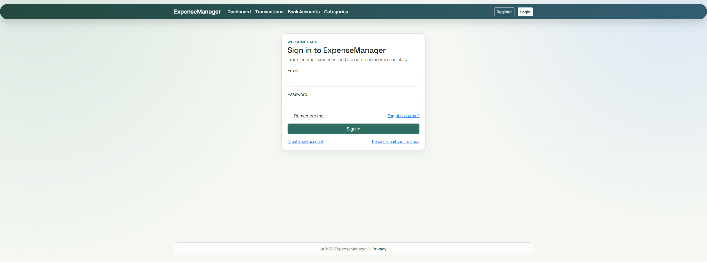
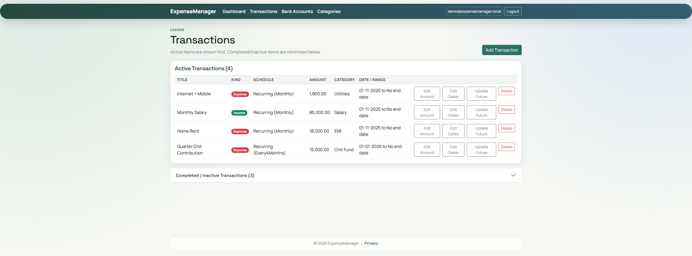
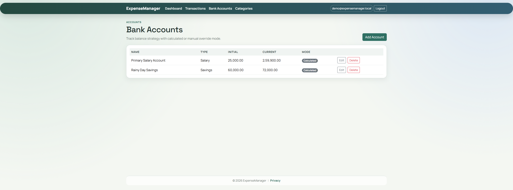
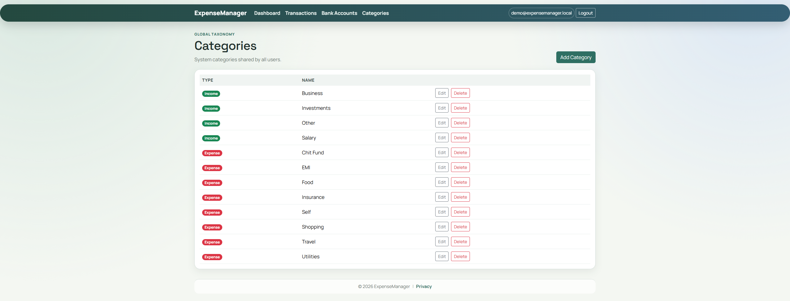

# Fintraq (ExpenseManager)

Personal finance tracker built with ASP.NET Core MVC, EF Core, and SQLite.



## Live Demo

- Site: http://fintraq.runasp.net/
- Demo user: `demo@expensemanager.local`
- Demo password: `Demo@12345`

## Stack

- .NET 10, ASP.NET Core MVC, Razor Views
- ASP.NET Core Identity (cookie auth)
- Entity Framework Core 10 + SQLite

## Features

- Register, login, logout
- One-time and recurring income/expense entries
- Monthly dashboard: income, expense, net, savings
- AI Chat (authenticated): ask month-wise balance, income, and expense questions
- Telegram & WhatsApp bots: link your account and manage finances from chat (balance, due items, log expenses)
- Due items list with mark done/revert (recurring + one-time)
- Category totals and account balance trend
- Bank accounts with calculated mode or manual override mode
- Soft delete for transactions and bank accounts
- Seeded demo account + sample data

## Important Notes

- Categories are global/shared across users.
- Expense entries require `Paid From Account`.
- Income entries can optionally set `Received To Account`.
- Recurring completion can store a month-specific amount for dashboard totals.

## Run Locally

### Prerequisites

- .NET 10 SDK

### Start

```bash
dotnet run --project ExpenseManager
```

## Database

Runtime SQLite file:

`<repo>/database/app.db`

On startup, the app applies migrations and seeds:

- default categories
- demo user
- demo financial data (if missing)

## AI Setup (Gemini, Anthropic, or Cursor)

Choose your AI provider in **Admin → AI settings**, or set in user secrets / `appsettings.json`:

```bash
# Provider: Gemini | Anthropic | Cursor
dotnet user-secrets --project ExpenseManager set "Ai:Provider" "Anthropic"

dotnet user-secrets --project ExpenseManager set "Gemini:ApiKey" "<your-gemini-api-key>"
dotnet user-secrets --project ExpenseManager set "Anthropic:ApiKey" "<your-anthropic-api-key>"
dotnet user-secrets --project ExpenseManager set "Cursor:ApiKey" "<your-cursor-api-key>"
```

- **Gemini** — Google AI Studio key; full tool-calling support (default).
- **Anthropic** — Claude API key from [console.anthropic.com](https://console.anthropic.com); full tool-calling support.
- **Cursor** — Cloud Agents API key from Cursor Dashboard → API Keys; uses no-repo agents (slower, context-based replies).

Then open `AI Chat` in the app navigation after login.

## Messaging Bots (Telegram & WhatsApp)

Link your Fintraq account to Telegram or WhatsApp and manage finances from chat.

### Configure (admin)

Admins configure the Telegram bot under **Admin → Telegram** (bot token, webhook secret, username, webhook URL, and one-click webhook registration).

Optional fallback in user secrets or `appsettings.json`:

```bash
dotnet user-secrets --project ExpenseManager set "Telegram:BotToken" "<your-telegram-bot-token>"
dotnet user-secrets --project ExpenseManager set "Telegram:WebhookSecret" "<random-secret>"
dotnet user-secrets --project ExpenseManager set "Telegram:BotUsername" "<your-bot-username>"
dotnet user-secrets --project ExpenseManager set "Telegram:WebhookUrl" "https://fintraq.runasp.net/api/webhooks/telegram"
```

### Link your account

1. Log in to Fintraq → **Messaging** in the nav
2. Generate a link code
3. Send `/link YOUR_CODE` to your Telegram or WhatsApp bot

### Webhooks (production)

- Telegram: `https://fintraq.runasp.net/api/webhooks/telegram`
- WhatsApp: `https://fintraq.runasp.net/api/webhooks/whatsapp`

Register Telegram webhook (replace values):

```bash
curl "https://api.telegram.org/bot<TOKEN>/setWebhook?url=https://fintraq.runasp.net/api/webhooks/telegram&secret_token=<WEBHOOK_SECRET>"
```

### Quick chat commands

| Command | Action |
|---------|--------|
| `balance` | Current month balance |
| `due` | Pending due items |
| `summary` | Month income/expense/net |
| `spent 500 food hdfc` | Log an expense |
| `mark netflix done` | Mark due item complete |

You can also ask natural-language questions — the same Gemini AI used in the website chat handles them.

## Project Layout

```text
ExpenseManager/
├── Areas/Identity/
├── Controllers/
├── Data/
├── Models/
├── Services/
├── Views/
├── wwwroot/
└── Program.cs
```

## Screens

- Login: 
- Transactions: 
- Bank Accounts: 
- Categories: 
